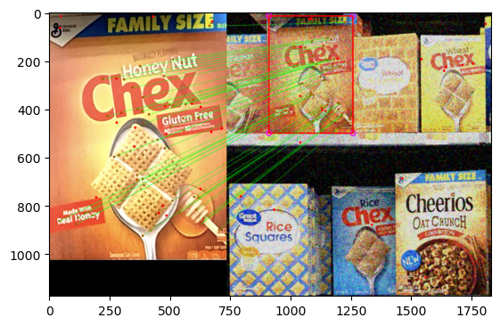
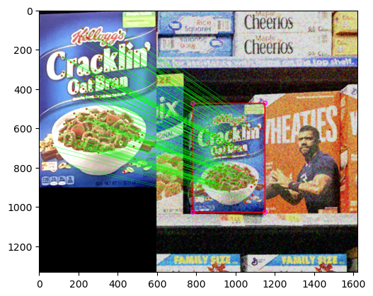

# Instance detection of grocery store products
This code in this repository consists in a Computer Vision system that, given a very noisy reference image for each product, is able to identify such product from one picture of a store shelf.

Both a Single Instance Detection and a Multiple Instance Detection system were developed, achieving pretty good results.

This project DOES NOT make use of any deep learning technique, relying instead on the instance detection methods provided by OpenCV.

  
  

This was also the first assignment for the Image Processing and Computer Vision A.Y. 2023/2024.
